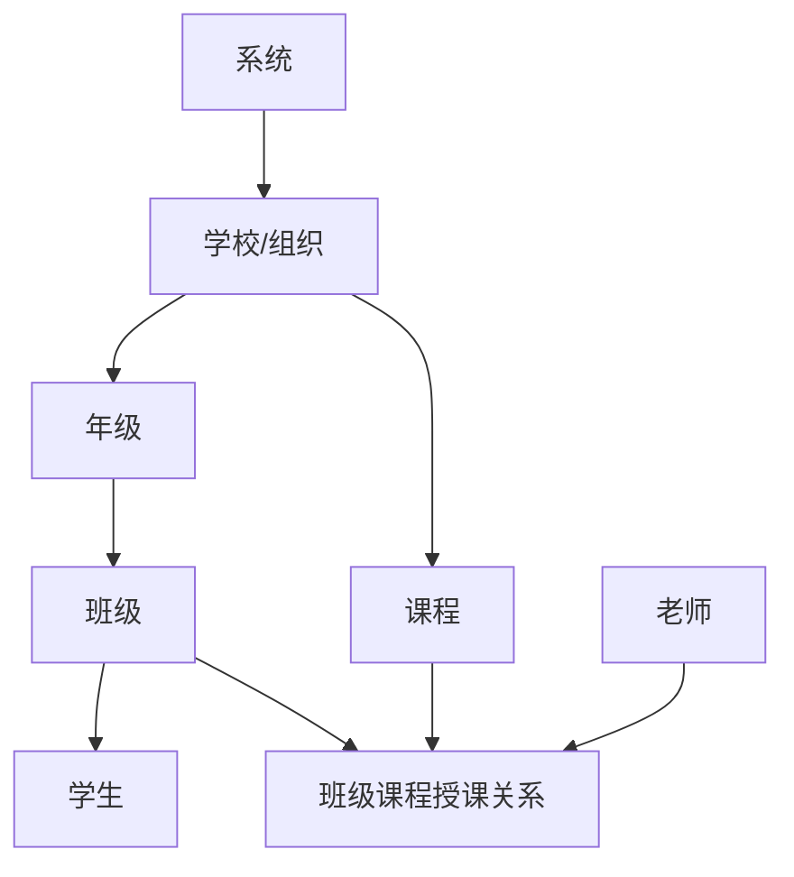

# 业务架构、层级关系与权限模型

## 1. 总体设计原则
1. **系统级管全局，租户级管本租户。**
2. **题库采用“归属 + 可见授权”模型**，避免为下发而复制大量题目。
3. **题目版本化**，质疑通过后产生新版本，不直接覆盖历史痕迹。
4. **练题、考试、组织变更均可追溯**，通过快照与历史表保证统计口径稳定。
5. **Web 优先，移动端预留**，共享领域模型、接口协议和状态规则。

## 2. 层级与关系

### 2.1 实体关系说明
- `租户（Tenant）`：学校或组织，是数据隔离的主边界。
- `年级（Grade）`：租户下的纵向层级。
- `班级（Class）`：年级下的教学单元。
- `课程（Course）`：租户下课程字典，可被多个班级使用。
- `老师（Teacher）`：以用户身份存在，通过“班级-课程-老师”关系表任课。
- `学生（Student）`：以用户身份存在，通过班级/课程关系参与学习。

### 2.2 关键约束
- 同一班级同一课程仅允许一个主授课老师。
- 一个学生可同时关联多门课程。
- 允许老师跨多个班级任课；默认不允许跨租户，若需要需额外审批与隔离设计。

## 3. 多租户模型
### 3.1 数据范围
- 系统级数据：全局角色、全局菜单、系统字典、系统标签、平台公告。
- 租户级数据：学校组织、年级、班级、课程、题库、考试、用户、数据统计。

### 3.2 隔离策略
- 所有租户级表必须带 `tenant_id`。
- 中间件从登录态解析 `tenant_id` 与 `scope`，写入请求上下文。
- Repository 层默认追加 `tenant_id` 条件；仅系统级接口可显式绕过。
- 任何跨租户聚合统计必须由系统管理员接口发起。

## 4. 角色与权限模型
### 4.1 建议角色
| 角色编码 | 适用端 | 范围 | 说明 |
|---|---|---|---|
| system_admin | 管理端 | 系统级 | 平台全量管理 |
| tenant_admin | 管理端 | 租户级 | 学校/组织管理员 |
| grade_manager | 管理端 | 年级级 | 可选角色 |
| class_manager | 管理端/用户端 | 班级级 | 班主任/教务 |
| teacher | 用户端 | 课程/班级 | 题库、考试、班级学习管理 |
| student | 用户端 | 个人 | 刷题、考试、评论、质疑 |

### 4.2 权限粒度
采用 `资源 + 动作 + 范围` 三元组。

示例：
- `question_bank:create:class`
- `question:challenge:any_visible`
- `exam:publish:course`
- `dashboard:view:tenant`

### 4.3 菜单与按钮权限
- 菜单权限控制“能否看到页面”；
- 按钮/接口权限控制“能否操作”；
- 数据权限控制“能看到哪些记录”；
- 三者均需独立实现，不能只做菜单隐藏。

## 5. 题库与题目域模型
### 5.1 归属与下发
题库和题目都具备：
- `owner_type`：SYSTEM / TENANT / GRADE / CLASS / TEACHER / STUDENT
- `owner_id`
- `source_id`：来源题库/题目
- `version`

### 5.2 为什么不直接复制下发
直接复制会带来：
- 上级修订无法同步；
- 多份题目重复统计；
- 质疑链路复杂；
- 历史版本难追溯。

因此一期建议：
- 题库下发采用 `question_bank_visibility` 授权表；
- 下级默认“使用权”，不是“编辑权”；
- 需要本地改造时，显式创建派生版本。

### 5.3 题目结构建议
统一使用 JSON 结构：
- `stem_content_json`：题干
- `options_json`：选项数组（支持数量不定与图文混合）
- `answer_json`：答案表达
- `analysis_json`：解析

### 5.4 练题与考试域
- 练题按 session 建模，记录来源题库、模式、过滤条件和作答明细。
- 考试按模板、试卷、考试实例、作答记录四层建模。
- 考试记录必须保留题目版本快照引用，避免题目后续修改影响历史结果。

## 6. 评论、标签、质疑
### 6.1 标签
- 系统标签：知识点、教材章节、难度标签，支持筛选
- 个人标签：用户私有，不影响公共题库治理

### 6.2 评论
- 用于讨论题目理解、易错点、解析建议
- 需支持引用回复与状态（正常/隐藏）

### 6.3 质疑
- 发起人：老师/学生
- 对象：当前不可编辑但可见的题目
- 流程：提交 → 审核 → 通过/驳回 → 版本更新/说明回复

## 7. 快照与历史
### 7.1 需要快照的业务事件
- 学生转班
- 升级/升学
- 毕业
- 离校
- 老师任课变更
- 班级课程调整
- 考试发布

### 7.2 快照保存策略
- 关键事件保存 `entity_snapshots`
- 业务历史明细表单独保存，如学生学籍流转表、教师任课历史表
- 统计报表读取时可按时间点回放快照

## 8. 为移动端预留的设计原则
1. 前端共享领域模型、类型定义、接口 SDK。
2. 业务规则不写在页面中，而写在 hooks / service / domain 层。
3. 页面布局组件与业务组件分离，未来移动端只替换展示层。
4. 所有接口返回避免直接依赖桌面端 UI 结构。
